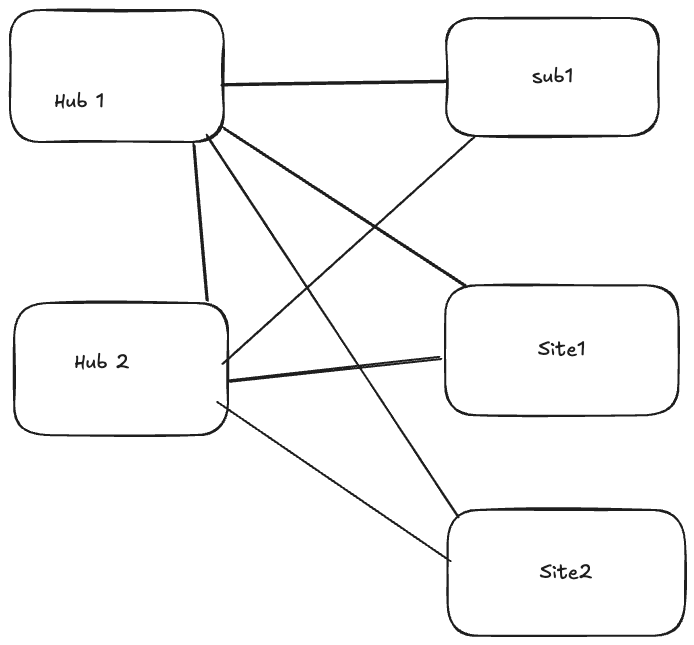
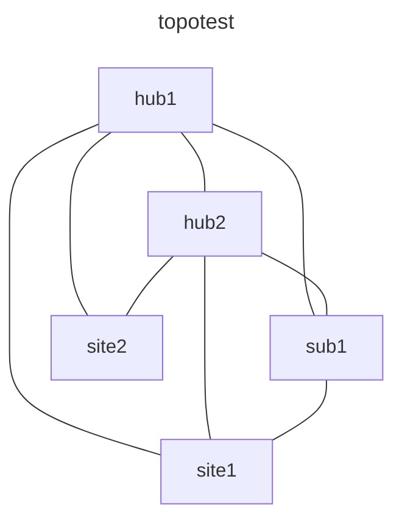

# Topotest - Containerlab Network Topology

A containerlab-based network topology for testing [walktopo](https://github.com/mhuot/walktopo) SNMP discovery capabilities.

## Topology Overview

This lab consists of 5 Arista cEOS nodes configured in a redundant hub-and-spoke topology:

### Original Design



### Network Diagram (Mermaid)



### Connections

The topology includes the following links:

| Link | Interface A | Interface B | Subnet |
|------|-------------|-------------|--------|
| Hub1 ↔ Hub2 | eth1 | eth1 | 10.0.12.0/30 |
| Hub1 ↔ sub1 | eth2 | eth1 | 10.0.13.0/30 |
| Hub1 ↔ Site1 | eth3 | eth1 | 10.0.14.0/30 |
| Hub1 ↔ Site2 | eth4 | eth1 | 10.0.15.0/30 |
| Hub2 ↔ sub1 | eth2 | eth2 | 10.0.23.0/30 |
| Hub2 ↔ Site1 | eth3 | eth2 | 10.0.24.0/30 |
| Hub2 ↔ Site2 | eth4 | eth2 | 10.0.25.0/30 |
| sub1 ↔ Site1 | eth3 | eth3 | 10.0.34.0/30 |

### Node Details

| Node | Container IP | Management IP | Description |
|------|-------------|---------------|-------------|
| hub1 | 172.20.20.6 | 192.168.1.101/24 | Primary hub router |
| hub2 | 172.20.20.2 | 192.168.1.102/24 | Secondary hub router |
| sub1 | 172.20.20.3 | 192.168.1.103/24 | Subscriber router |
| site1 | 172.20.20.4 | 192.168.1.104/24 | Site 1 router |
| site2 | 172.20.20.5 | 192.168.1.105/24 | Site 2 router |

## Prerequisites

- macOS with Apple Silicon (ARM64)
- [OrbStack](https://orbstack.dev/) installed
- Docker installed in OrbStack VM
- Containerlab installed in OrbStack VM

## Setup Instructions

### 1. Install OrbStack and Create VM

```bash
# Create a Linux VM in OrbStack
orb create ubuntu clab

# Install Docker in the VM
orb exec -m clab -s "curl -fsSL https://get.docker.com | sudo sh"

# Install Containerlab (already installed if using the clab VM)
```

### 2. Import cEOS Image

The lab requires the Arista cEOS ARM image. Download it from [Arista's Getting Started with cEOS-lab in Containerlab guide](https://arista.my.site.com/AristaCommunity/s/article/Getting-Started-with-cEOS-lab-in-Containerlab).

Import the ARM64 image into the VM's Docker:

```bash
# Import the cEOS image (from your cEOS tar file)
orb exec -m clab docker import cEOSarm-lab-4.35.1F.tar ceosarm:4.35.1F
```

**Note**: Make sure to download the ARM64 version (e.g., `cEOSarm-lab-4.35.1F.tar.xz`) for Apple Silicon Macs.

### 3. Deploy the Lab

```bash
# Deploy the topology
orb exec -m clab sudo containerlab deploy -t /Users/mhuot/topotest/topology.clab.yml

# Verify deployment
orb exec -m clab sudo containerlab inspect -t /Users/mhuot/topotest/topology.clab.yml
```

### 4. Access the Lab

```bash
# SSH to any node
orb exec -m clab ssh admin@clab-topotest-hub1

# Or use docker exec
orb exec -m clab docker exec -it clab-topotest-hub1 Cli
```

## SNMP Configuration

All nodes are pre-configured with:
- **SNMP Community**: `public` (read-only)
- **SNMP Version**: v2c
- **UDP Port**: 161
- **LLDP**: Enabled on all interfaces

## Testing with Walktopo

### Install Walktopo in VM

```bash
# Copy walktopo binary to VM
orb push -m clab /path/to/walktopo-linux-arm64 /tmp/walktopo
orb exec -m clab sudo mv /tmp/walktopo /usr/local/bin/walktopo
orb exec -m clab sudo chmod +x /usr/local/bin/walktopo
```

### Run SNMP Discovery

From within the clab VM:

```bash
# Using a seed IP to discover topology
walktopo run --file job.json --api-url http://host.orb.internal:8081 --upload
```

**Seed IP**: Use any node IP, e.g., `172.20.20.6` (hub1)

**Note**: If uploading to lldp-me or another service running on your Mac, use `host.orb.internal` instead of `localhost` to reach the Mac from the VM.

### Example Job File

```json
{
  "job_id": "topotest-001",
  "created_at": "2026-02-06T21:15:00Z",
  "targets": [
    {
      "host": "172.20.20.6",
      "port": 161,
      "community": "public",
      "snmp_version": "v2c",
      "oids": [
        "1.3.6.1.2.1.1",
        "1.0.8802.1.1.2"
      ],
      "timeout_seconds": 10,
      "retries": 2,
      "label": "hub1"
    }
  ]
}
```

## Lab Management

### View Topology Graph

```bash
# Generate and view interactive graph
orb exec -m clab sudo containerlab graph -t /Users/mhuot/topotest/topology.clab.yml
```

### Save Configurations

```bash
# Save running configs
orb exec -m clab sudo containerlab save -t /Users/mhuot/topotest/topology.clab.yml
```

### Destroy Lab

```bash
# Destroy the topology
orb exec -m clab sudo containerlab destroy -t /Users/mhuot/topotest/topology.clab.yml
```

## Files

- `topology.clab.yml` - Containerlab topology definition
- `configs/` - Device startup configurations
  - `hub1.cfg` - Hub1 configuration
  - `hub2.cfg` - Hub2 configuration
  - `sub1.cfg` - Sub1 configuration
  - `site1.cfg` - Site1 configuration
  - `site2.cfg` - Site2 configuration
- `topology.clab.drawio` - Draw.io diagram export
- `clab-topotest/` - Lab runtime directory (created by containerlab)

## Troubleshooting

### Cannot reach containers from Mac
The container IPs (172.20.20.x) are only accessible from within the clab VM. Either:
- Run walktopo/tools from within the VM
- Use SSH port forwarding
- Use containerlab's built-in features

### Image format errors
Ensure you're using the ARM64 version of cEOS and that it's properly imported using `docker import` (not `docker load`).

### SNMP timeouts
- Verify SNMP is enabled: `show snmp community`
- Check firewall rules in the container
- Ensure you're testing from within the clab VM network

## Contributing

This lab is designed for testing walktopo SNMP discovery. Feel free to modify the topology or configurations for your testing needs.

## License

See main walktopo project for license information.
