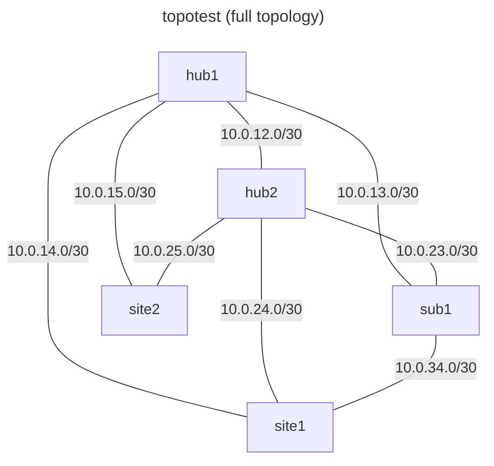
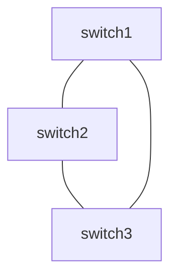
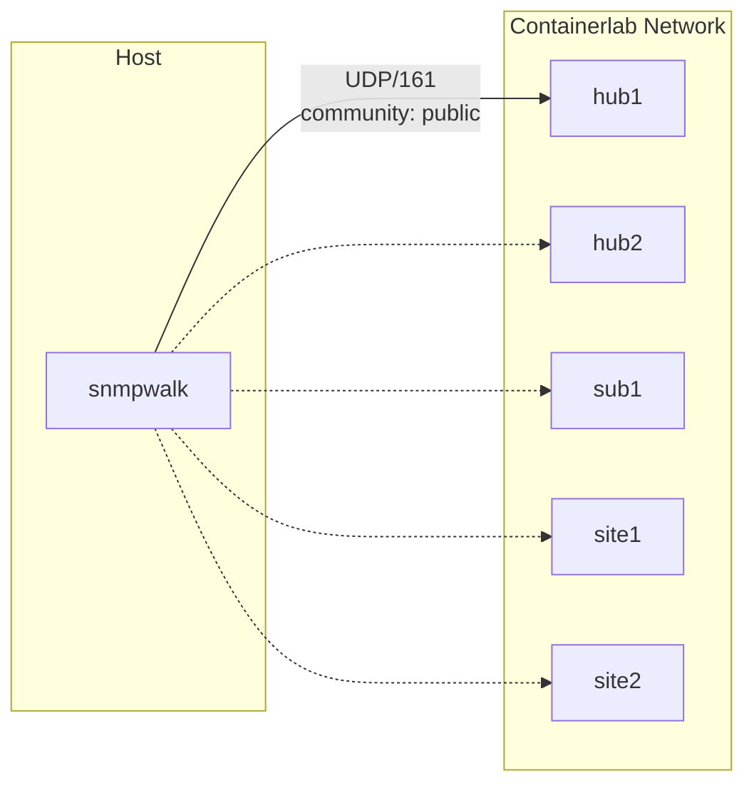
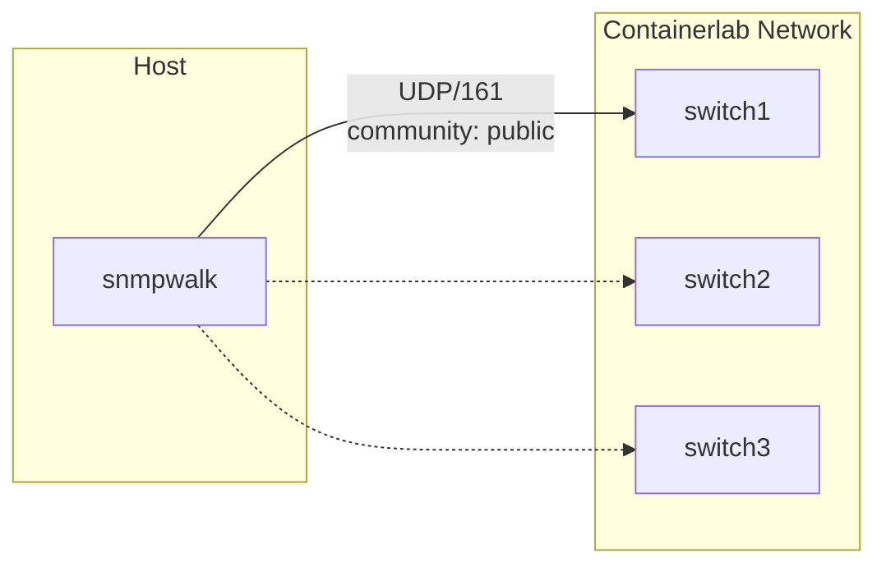

# Topotest - Containerlab Network Topology

A containerlab-based network topology for testing [walktopo](https://github.com/mhuot/walktopo) SNMP discovery capabilities.

Supports **macOS ARM64** (Apple Silicon, via OrbStack) and **Linux x86_64** (native).

## Topology Overview

This lab consists of 5 Arista cEOS nodes configured in a redundant hub-and-spoke topology:

### Original Design


### Network Diagram (Mermaid)



### Connections

The topology includes the following links:

| Link | Interface A | Interface B | Subnet |
|------|-------------|-------------|--------|
| Hub1 ↔ Hub2 | eth1 | eth1 | 10.0.12.0/30 |
| Hub1 ↔ sub1 | eth2 | eth1 | 10.0.13.0/30 |
| Hub1 ↔ Site1 | eth3 | eth1 | 10.0.14.0/30 |
| Hub1 ↔ Site2 | eth4 | eth1 | 10.0.15.0/30 |
| Hub2 ↔ sub1 | eth2 | eth2 | 10.0.23.0/30 |
| Hub2 ↔ Site1 | eth3 | eth2 | 10.0.24.0/30 |
| Hub2 ↔ Site2 | eth4 | eth2 | 10.0.25.0/30 |
| sub1 ↔ Site1 | eth3 | eth3 | 10.0.34.0/30 |

### Node Details

| Node | Management IP | Description |
|------|---------------|-------------|
| hub1 | 192.168.1.101/24 | Primary hub router |
| hub2 | 192.168.1.102/24 | Secondary hub router |
| sub1 | 192.168.1.103/24 | Subscriber router |
| site1 | 192.168.1.104/24 | Site 1 router |
| site2 | 192.168.1.105/24 | Site 2 router |

> **Note:** Container IPs (172.20.20.x range) are assigned dynamically by containerlab and may change between deployments. Run `./lab.sh inspect` to see the current IPs. The management IPs above are statically configured in each node's startup config.

## Quick Start

The `lab.sh` helper script auto-detects your platform and wraps all containerlab commands:

```bash
./lab.sh info       # Show detected platform and image
./lab.sh deploy     # Deploy the lab
./lab.sh inspect    # Check lab status
./lab.sh ssh hub1   # SSH to a node
./lab.sh destroy    # Tear down the lab
```

For the minimal Alpine topology (no cEOS image required):

```bash
./lab.sh --minimal deploy     # Deploy minimal lab
./lab.sh --minimal inspect    # Check status
./lab.sh --minimal exec switch1  # Shell into a node
./lab.sh --minimal destroy    # Tear down
```

Run `./lab.sh help` for all available commands.

## Minimal Topology (Low Resource Alternative)

For quick testing without the overhead of cEOS images, use the minimal topology with Alpine Linux containers:

```bash
./lab.sh --minimal deploy          # Deploy minimal lab
./lab.sh --minimal inspect         # Check status
./lab.sh --minimal exec switch1    # Shell into a node
./lab.sh --minimal destroy         # Tear down
```

### Minimal Nodes

3 Alpine Linux containers connected in a triangle:



| Link | Interface A | Interface B |
|------|-------------|-------------|
| switch1 ↔ switch2 | eth1 | eth1 |
| switch2 ↔ switch3 | eth2 | eth1 |
| switch3 ↔ switch1 | eth2 | eth2 |

Each node installs `lldpd` and `net-snmp` at startup via exec commands. SNMP community is `public` (v2c).

### Comparison

| Feature | Full (cEOS) | Minimal (Alpine) |
|---------|-------------|------------------|
| Nodes | 5 cEOS routers | 3 Alpine Linux |
| Memory per node | ~1.5GB | ~50MB |
| Image download | Arista account required | Public Alpine image |
| SNMP | Yes (v2c, community: public) | Yes (v2c, community: public) |
| LLDP | Yes | Yes |
| Routing protocols | Full EOS features | None |

The minimal topology is ideal for walktopo SNMP/LLDP discovery testing when you don't need full routing capabilities.

## Prerequisites

### macOS (Apple Silicon)

- [OrbStack](https://orbstack.dev/) installed
- Docker available in OrbStack VM
- Containerlab installed in OrbStack VM
- Arista cEOS **ARM64** image (`ceosarm:4.35.1F`)

### Linux (x86_64)

- Docker installed
- [Containerlab](https://containerlab.dev/install/) installed (v0.41+)
- Arista cEOS **x86_64** image (`ceos64:4.35.1F`)

## Importing the Arista cEOS Image

Containerlab uses the Arista cEOS (containerized EOS) image to run each node. You must download it from Arista and import it into Docker before deploying the lab.

### 1. Create an Arista Account

Register for a free account at [arista.com](https://www.arista.com/en/user-registration). No support contract is required — cEOS-lab images are available to all registered users.

### 2. Download the Image

Go to the [Arista Software Downloads](https://www.arista.com/en/support/software-download) page. Navigate to **cEOS-lab** and download the correct image for your platform:

| Platform | Image File | Docker Tag |
|----------|-----------|------------|
| Linux x86_64 | `cEOS64-lab-4.35.1F.tar` | `ceos64:4.35.1F` |
| macOS ARM64 (Apple Silicon) | `cEOSarm-lab-4.35.1F.tar` | `ceosarm:4.35.1F` |

> **Tip:** Look under the **4.35.1F** release. The ARM64 image is listed separately as `cEOS-lab-arm` or similar. If you want a different version, update the `CEOS_IMAGE` environment variable accordingly (see [Environment Variables](#environment-variables)).

### 3. Import the Image

Use `./lab.sh import` which runs `docker import` with the correct tag for your platform:

**Linux:**

```bash
./lab.sh import cEOS64-lab-4.35.1F.tar
```

**macOS:**

```bash
./lab.sh import cEOSarm-lab-4.35.1F.tar
```

> **Important:** cEOS images must be imported with `docker import`, not `docker load`. The `lab.sh import` command handles this correctly. If importing manually, run:
> ```bash
> docker import cEOS64-lab-4.35.1F.tar ceos64:4.35.1F
> ```

### 4. Verify the Image

Confirm the image was imported successfully:

**Linux:**

```bash
docker images | grep ceos
```

**macOS (inside OrbStack VM):**

```bash
orb exec -m clab docker images | grep ceos
```

You should see output like:

```
ceos64       4.35.1F    abc123def456   About a minute ago   2.1GB
```

## Setup Instructions

### macOS Setup

#### 1. Install OrbStack and Create VM

```bash
# Create a Linux VM in OrbStack
orb create ubuntu clab

# Install Docker in the VM
orb exec -m clab -s "curl -fsSL https://get.docker.com | sudo sh"

# Install Containerlab in the VM
orb exec -m clab bash -c "curl -sL https://containerlab.dev/setup | sudo bash"
```

#### 2. Import cEOS Image

Follow the [Importing the Arista cEOS Image](#importing-the-arista-ceos-image) instructions above to download and import `cEOSarm-lab-4.35.1F.tar`.

### Linux Setup

#### 1. Install Containerlab

```bash
curl -sL https://containerlab.dev/setup | sudo bash
```

Docker must already be installed. See [Docker installation docs](https://docs.docker.com/engine/install/) if needed.

#### 2. Import cEOS Image

Follow the [Importing the Arista cEOS Image](#importing-the-arista-ceos-image) instructions above to download and import `cEOS64-lab-4.35.1F.tar`.

### Deploy the Lab

```bash
./lab.sh deploy
```

### Access Nodes

```bash
# SSH to any node
./lab.sh ssh hub1

# Open Arista Cli on a node
./lab.sh exec hub1
```

## SNMP Configuration

All nodes are pre-configured with:
- **SNMP Community**: `public` (read-only)
- **SNMP Version**: v2c
- **UDP Port**: 161
- **LLDP**: Enabled on all interfaces

## SNMP Testing with snmpwalk

You can query any node directly using `snmpwalk` to verify SNMP is working before running walktopo.

### Full Topology



### Minimal Topology



### Install snmpwalk

**Linux (Debian/Ubuntu):**

```bash
sudo apt-get install snmp
```

**macOS:**

```bash
brew install net-snmp
```

### Running snmpwalk

**Linux** — container IPs are reachable directly from the host:

```bash
# System description
snmpwalk -v2c -c public 172.20.20.6 1.3.6.1.2.1.1

# LLDP neighbor table
snmpwalk -v2c -c public 172.20.20.6 1.0.8802.1.1.2

# Walk all nodes
for ip in 172.20.20.6 172.20.20.2 172.20.20.3 172.20.20.4 172.20.20.5; do
  echo "=== $ip ==="
  snmpwalk -v2c -c public "$ip" 1.3.6.1.2.1.1.1.0
done
```

**macOS** — must run from inside the OrbStack VM:

```bash
# Install snmp tools in the VM
orb exec -m clab sudo apt-get install -y snmp

# Run snmpwalk from the VM
orb exec -m clab snmpwalk -v2c -c public 172.20.20.6 1.3.6.1.2.1.1
```

### Common OIDs

| OID | Description |
|-----|-------------|
| `1.3.6.1.2.1.1` | System MIB (sysDescr, sysName, etc.) |
| `1.3.6.1.2.1.1.1.0` | sysDescr — system description string |
| `1.3.6.1.2.1.1.5.0` | sysName — hostname |
| `1.3.6.1.2.1.2.2` | Interfaces table (ifDescr, ifType, etc.) |
| `1.0.8802.1.1.2` | LLDP MIB — neighbor discovery data |

## Testing with Walktopo

Walktopo must run where it can reach the container network (172.20.20.0/24). On macOS this means inside the OrbStack VM; on Linux it can run directly on the host.

### Install Walktopo

#### Option 1: Download Pre-built Binary (Easiest)

Download from the [walktopo releases page](https://github.com/mhuot/walktopo/releases):

**Linux x86_64:**

```bash
curl -LO https://github.com/mhuot/walktopo/releases/latest/download/walktopo_linux_amd64.tar.gz
tar -xzf walktopo_linux_amd64.tar.gz
sudo mv walktopo /usr/local/bin/walktopo
sudo chmod +x /usr/local/bin/walktopo
```

**macOS (install into OrbStack VM):**

```bash
cd ~/Downloads
curl -LO https://github.com/mhuot/walktopo/releases/latest/download/walktopo_linux_arm64.tar.gz
tar -xzf walktopo_linux_arm64.tar.gz
orb push -m clab walktopo /tmp/walktopo
orb exec -m clab sudo mv /tmp/walktopo /usr/local/bin/walktopo
orb exec -m clab sudo chmod +x /usr/local/bin/walktopo
```

#### Option 2: Build from Source

```bash
git clone https://github.com/mhuot/walktopo.git
cd walktopo
go build -o walktopo ./cmd/walktopo
sudo mv walktopo /usr/local/bin/walktopo
```

On macOS, cross-compile for Linux ARM64 and copy into the VM:

```bash
GOOS=linux GOARCH=arm64 go build -o walktopo-linux-arm64 ./cmd/walktopo
orb push -m clab walktopo-linux-arm64 /tmp/walktopo
orb exec -m clab sudo mv /tmp/walktopo /usr/local/bin/walktopo
orb exec -m clab sudo chmod +x /usr/local/bin/walktopo
```

### Run SNMP Discovery

```bash
walktopo run --file job.json --api-url http://<host>:8081 --upload
```

- **Linux**: Use `http://localhost:8081` for host services.
- **macOS (in VM)**: Use `http://host.orb.internal:8081` to reach the Mac.

**Seed IP**: Use any node IP, e.g., `172.20.20.6` (hub1).

### Example Job File

```json
{
  "job_id": "topotest-001",
  "created_at": "2026-02-06T21:15:00Z",
  "targets": [
    {
      "host": "172.20.20.6",
      "port": 161,
      "community": "public",
      "snmp_version": "v2c",
      "oids": [
        "1.3.6.1.2.1.1",
        "1.0.8802.1.1.2"
      ],
      "timeout_seconds": 10,
      "retries": 2,
      "label": "hub1"
    }
  ]
}
```

## Lab Management

```bash
./lab.sh inspect     # Show lab status
./lab.sh save        # Save running configs
./lab.sh graph       # Generate topology graph
./lab.sh destroy     # Destroy the lab
```

### Manual Commands

If you prefer not to use `lab.sh`, you can run containerlab directly:

**Linux:**
```bash
sudo containerlab deploy -t topology.clab.yml
sudo containerlab inspect -t topology.clab.yml
sudo containerlab destroy -t topology.clab.yml
```

**macOS (via OrbStack):**
```bash
orb exec -m clab sudo containerlab deploy -t /path/to/topology.clab.yml
orb exec -m clab sudo containerlab inspect -t /path/to/topology.clab.yml
orb exec -m clab sudo containerlab destroy -t /path/to/topology.clab.yml
```

## Environment Variables

| Variable | Description | Default |
|----------|-------------|---------|
| `CEOS_IMAGE` | Docker image name for cEOS nodes | `ceos64:4.35.1F` (x86_64) or `ceosarm:4.35.1F` (arm64) |

The topology file uses `${CEOS_IMAGE:-ceos64:4.35.1F}` so it works with or without `lab.sh`. Override it to use a different image version:

```bash
CEOS_IMAGE=ceos64:4.36.0F ./lab.sh deploy
```

## Files

- `topology.clab.yml` - Full Arista cEOS topology (5 nodes)
- `topology-minimal.clab.yml` - Lightweight Alpine topology (3 nodes)
- `lab.sh` - Cross-platform helper script
- `configs/` - Device startup configurations (cEOS only)
  - `hub1.cfg` - Hub1 configuration
  - `hub2.cfg` - Hub2 configuration
  - `sub1.cfg` - Sub1 configuration
  - `site1.cfg` - Site1 configuration
  - `site2.cfg` - Site2 configuration
- `topology.clab.drawio` - Draw.io diagram export

## Troubleshooting

### Cannot reach containers from Mac
The container IPs (172.20.20.x) are only accessible from within the clab VM. Either:
- Run walktopo/tools from within the VM
- Use SSH port forwarding
- Use containerlab's built-in features

On Linux, container IPs are reachable directly from the host.

### Image format errors
Ensure you're using the correct architecture image for your platform and that it's properly imported using `docker import` (not `docker load`).

### SNMP timeouts
- Verify SNMP is enabled: `show snmp community`
- Check firewall rules in the container
- Ensure you're testing from a network that can reach the container IPs

## Contributing

This lab is designed for testing walktopo SNMP discovery. Feel free to modify the topology or configurations for your testing needs.

## License

See main walktopo project for license information.
